# LabTrack System - Complete Process Flowchart

## LabTrack Operational Flow - Thesis Project
### Computer Laboratory Management System with RFID Access Control

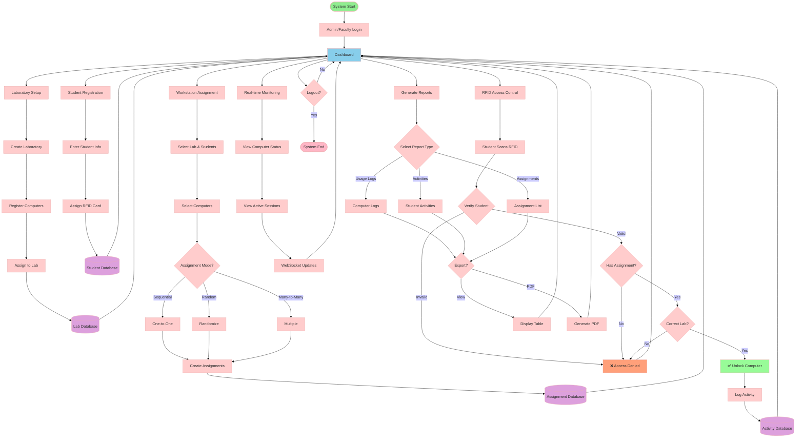

---

## Thesis Core Operations Summary

### 1️⃣ **Laboratory Setup**
- Create and configure computer laboratories
- Auto-register computers via network detection (IP/MAC)
- Assign computers to specific laboratories
- Enable real-time heartbeat monitoring (online/offline status)

### 2️⃣ **Student Registration**
- Register students with complete information (Name, ID, Program, Year, Section)
- Assign RFID cards to students
- Link RFID UID to student database records

### 3️⃣ **Workstation Assignment**
- Bulk assignment interface for efficient management
- Multiple assignment modes:
  - **Sequential**: One-to-one pairing
  - **Random**: Randomized distribution
  - **Many-to-Many**: Each student can access multiple computers
- Real-time validation and duplicate checking
- WebSocket broadcasting for instant UI updates

### 4️⃣ **RFID Access Control** (Core Thesis Feature)
- Student scans RFID card at computer
- System validates:
  - ✅ Student exists in database
  - ✅ Student has computer assignment
  - ✅ Assignment is for current laboratory
- Automatic computer unlock on successful validation
- Activity logging (who, what, when, where)
- Real-time dashboard updates

### 5️⃣ **Real-time Monitoring**
- Live computer status (online/offline/locked)
- Active student sessions tracking
- WebSocket-based instant updates
- Laboratory occupancy overview

### 6️⃣ **Reports & Analytics**
- Computer usage logs
- Student activity tracking
- Browser history monitoring
- Assignment reports
- Filtered PDF exports with complete data

---

## Key Technologies

- **Frontend**: Vue.js 3 (Composition API), Pinia State Management
- **Backend**: Laravel 11 (PHP), RESTful API
- **Database**: MySQL (Eloquent ORM)
- **Real-time**: Laravel Reverb/Pusher (WebSocket)
- **Authentication**: Laravel Sanctum (Token-based)
- **Hardware**: RFID Readers (RC522/EM18)
- **PDF Export**: jsPDF with autoTable

## System Overview (Simplified)

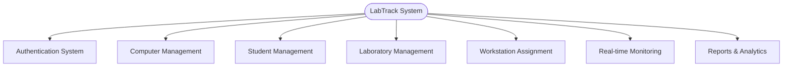

## 1. Authentication & Authorization Flow

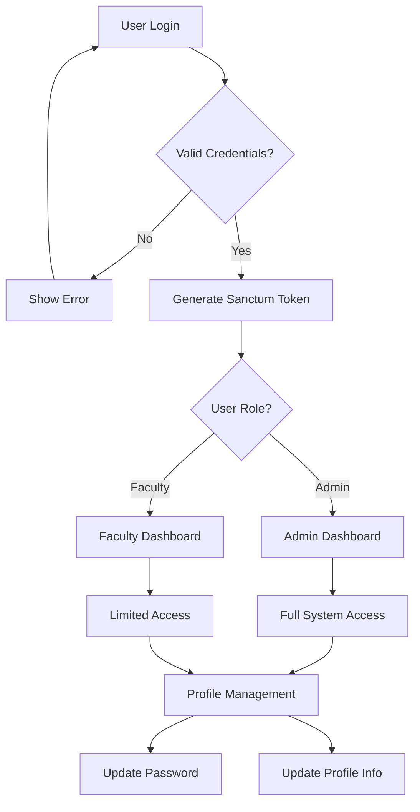

## 2. Computer Management Flow

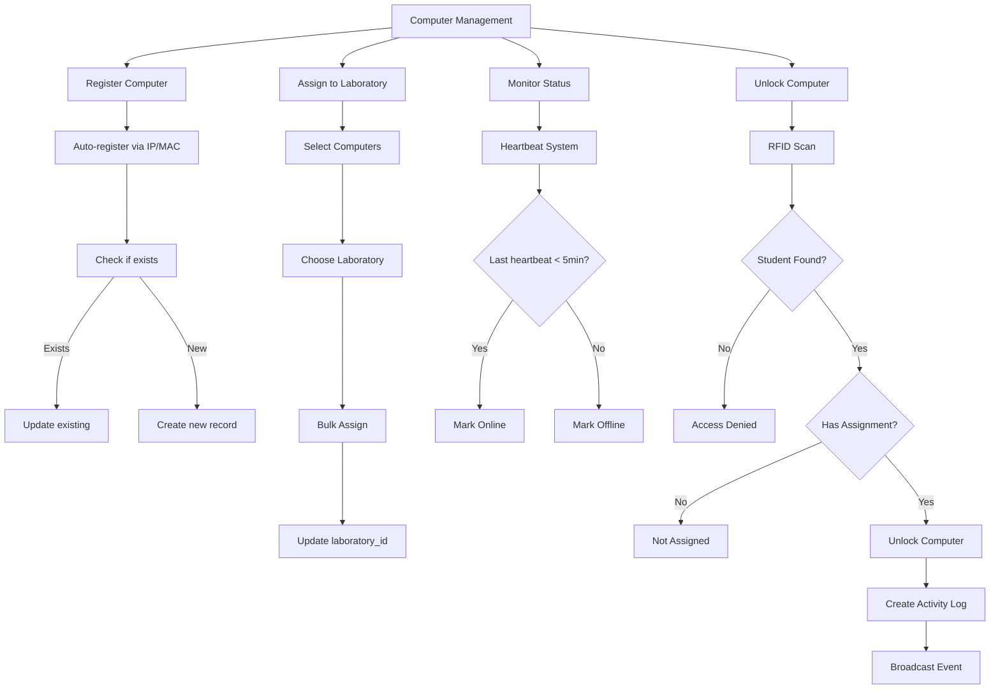

## 3. Student Management Flow

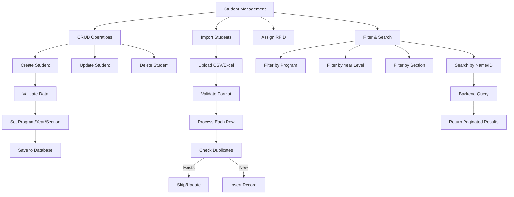

## 4. Workstation Assignment Flow (Bulk Assignment)

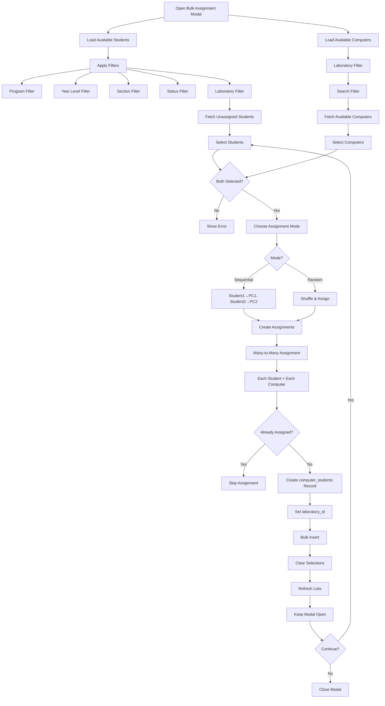

## 5. Real-time Monitoring Flow

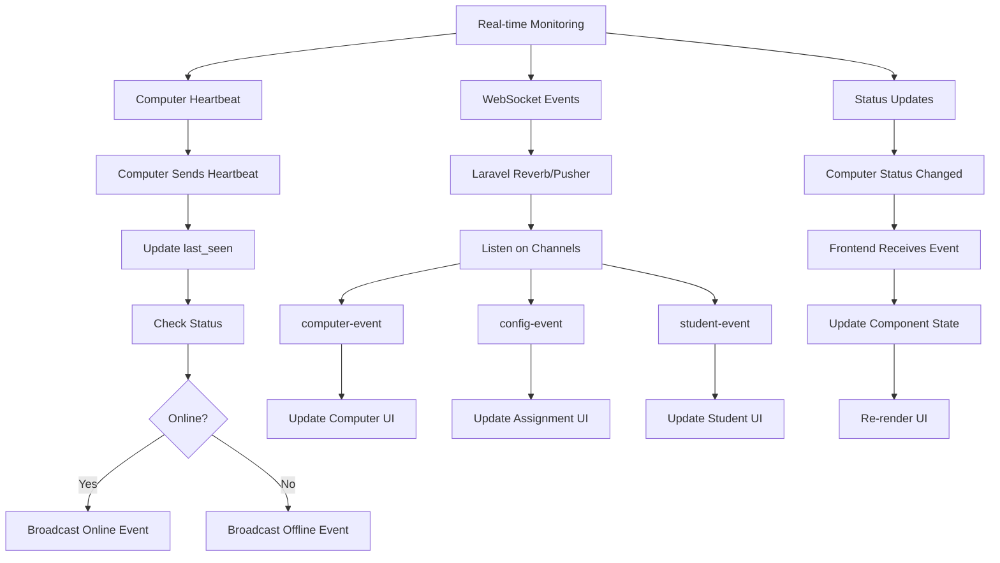

## 6. Computer Unlock Flow (RFID System)

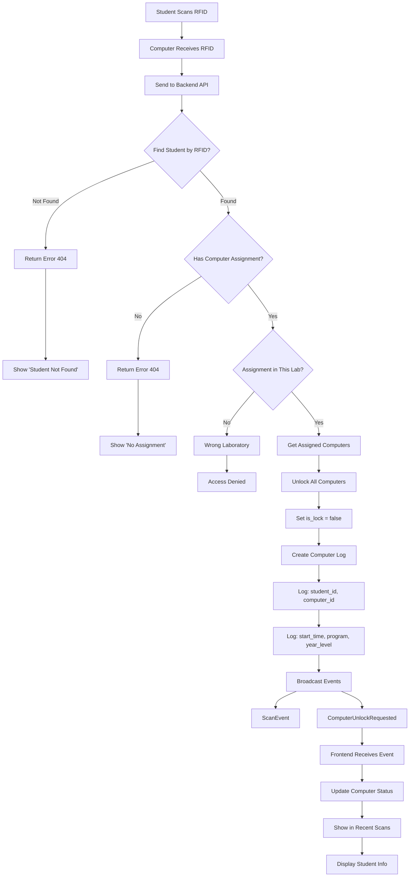

## 7. Laboratory Management Flow

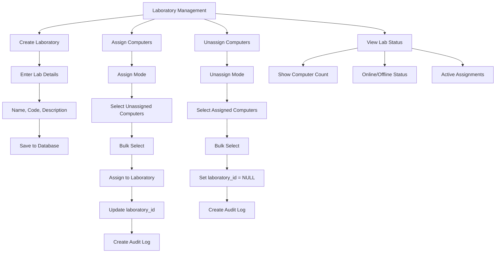

## 8. Reports & PDF Export Flow

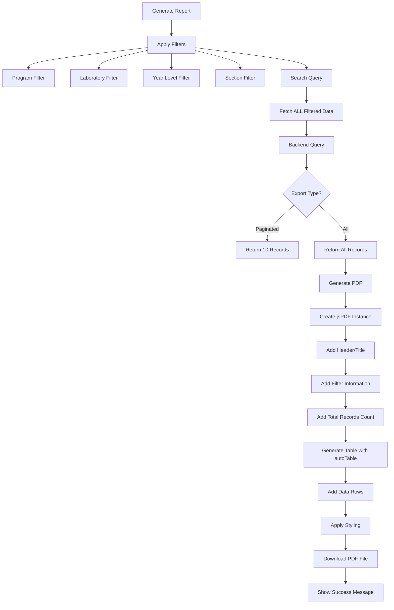

## 9. Activity Logging & Audit Flow

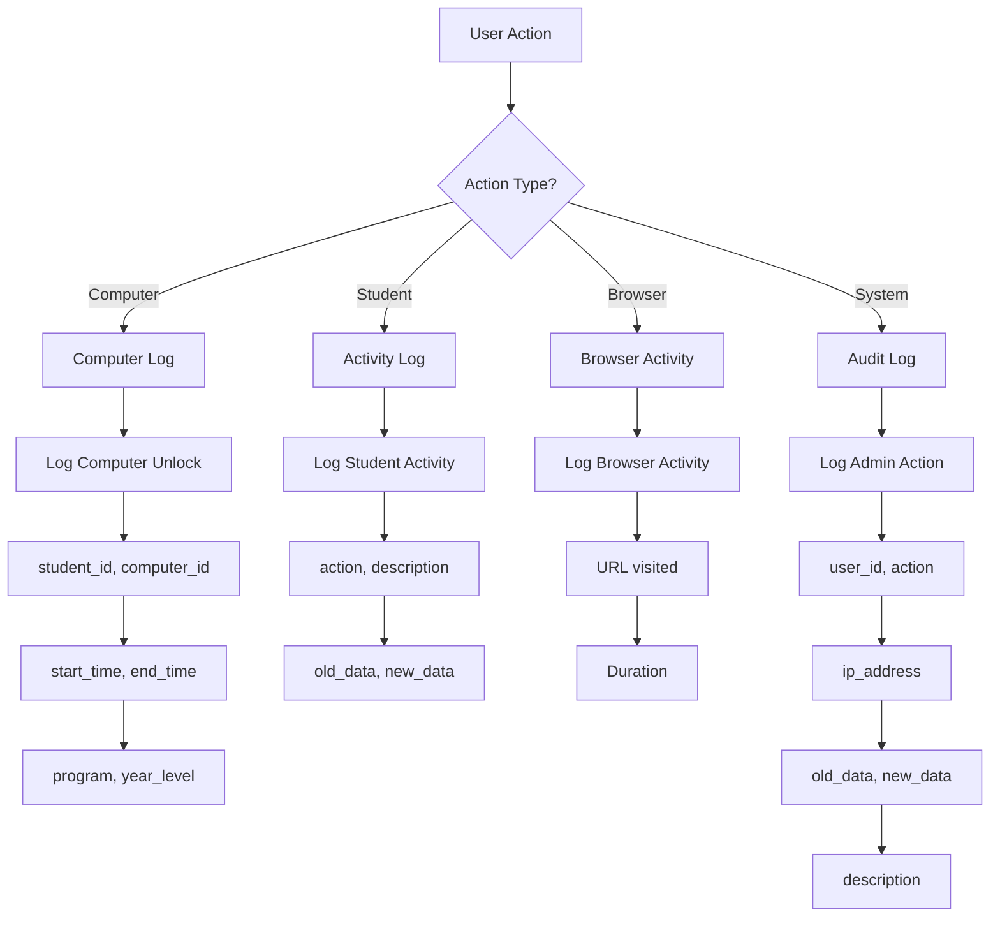

## 10. Data Sync & Broadcasting Flow

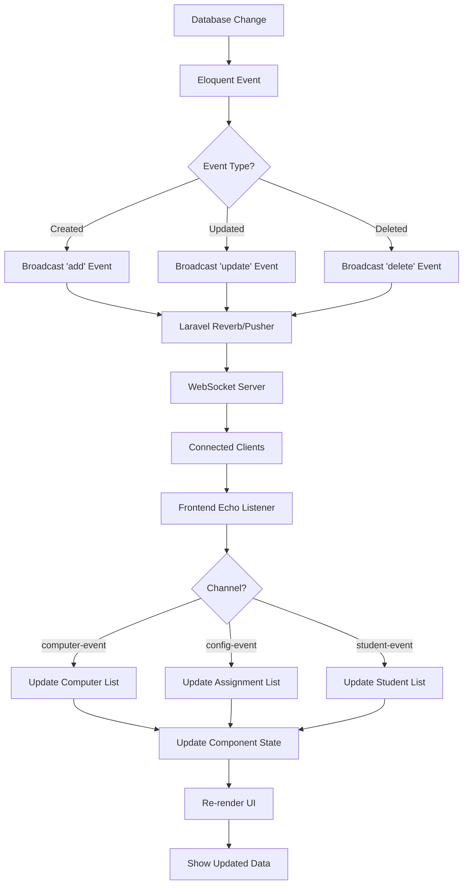

## 11. Search & Filter System

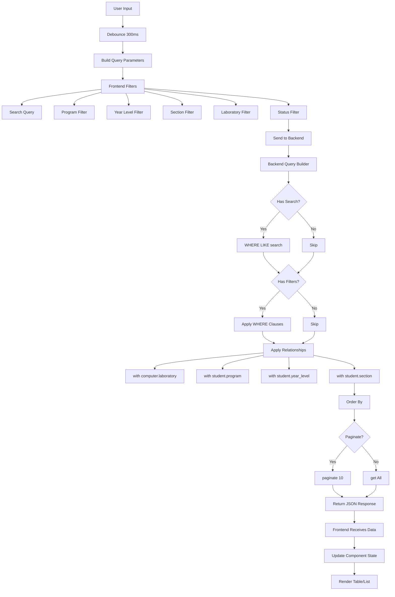

## 12. System Architecture Overview

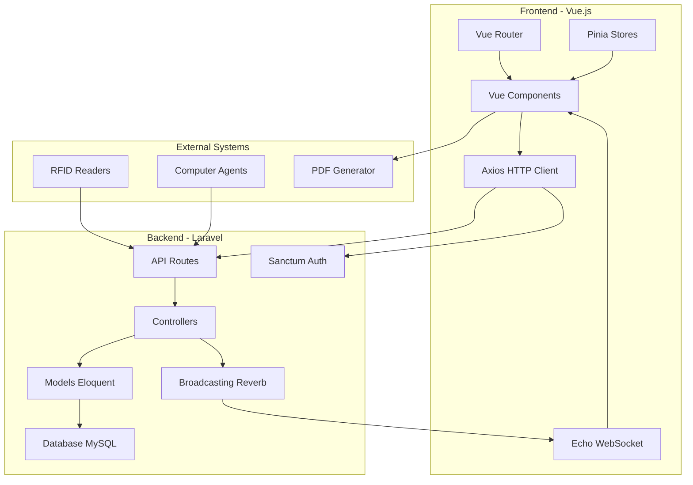

## 13. Complete User Journey - Student Assignment

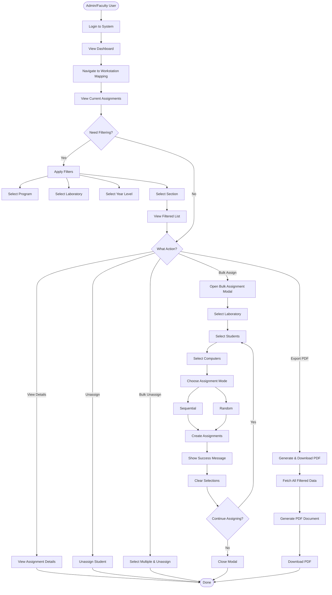

## 14. Database Schema Relationships

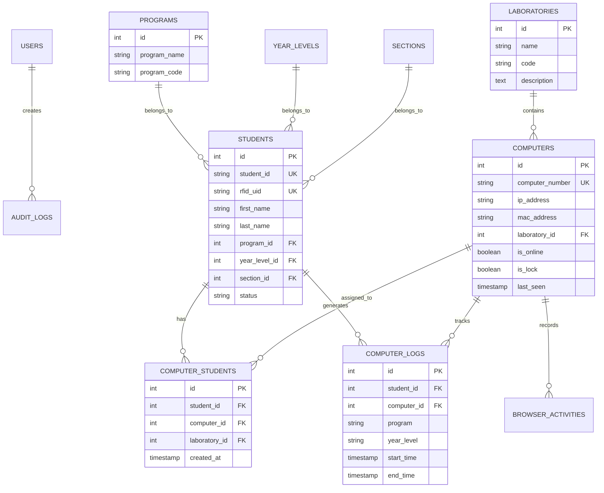

---

## Summary

This flowchart system covers:

1. **Authentication** - Login, role-based access, profile management
2. **Computer Management** - Registration, assignment, monitoring, unlocking
3. **Student Management** - CRUD, import, RFID assignment, filtering
4. **Workstation Assignment** - Bulk many-to-many assignments with filters
5. **Real-time Monitoring** - WebSocket events, status updates
6. **RFID Unlock System** - Student authentication, computer unlock
7. **Laboratory Management** - Lab creation, computer assignment
8. **Reports & Export** - Filtered PDF generation
9. **Activity Logging** - Comprehensive audit trails
10. **Data Broadcasting** - Real-time UI updates
11. **Search & Filter** - Debounced backend queries
12. **System Architecture** - Frontend/Backend integration
13. **User Journey** - Complete workflow example
14. **Database Schema** - Entity relationships

The system is designed as a **real-time computer laboratory management system** with RFID-based access control, comprehensive assignment management, and detailed activity tracking.
